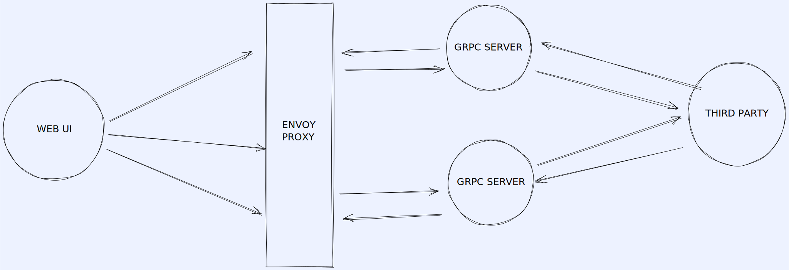

# Weather App Report

### Application 


Technologies used:

- Node
- ReactJs
- Grpc
- Docker

Features :
- Grpc Integration
- AutoComplete Suggestion

The project folder directory is divided into

- app/backend : contains the backend service for retrieving weather data.
- app/frontend : contains the user interface for interacting with the backend data .

## Running this project

I used docker during development, so it should be pretty easy to run this project if you have docker installed on your local machine. If not, you would have to run each service independently.

Both processes involve cloning this repositry, so go ahead with that first.

### Running with docker

After cloning this repository,

navigate into the project directory and run the command below

First, you need to build the images

```bash
docker-compose build
```

```bash
docker-compose up
```

On your browser, open up

=> `http://localhost:3000` - To view the weather-app website

### Running each service independently without Docker

To run the app if you do not wish to run it using Docker....

- Running the app/backend: Navigate into the base directory and run
  ```bash
  npm install && npm start
  ```
- Running the app/frontend : Navigate into the app directory and run

  ```bash
  cd app/frontend
  npm install && npm run grpc::server
  ```

The commands you ran should install the necessary dependencies and run each service.

On your browser, open up

- `http://localhost:3000` - To view the application on browser

## Problem Solving Approach

The idea was to use GRPC technology in place of REST APIs to serve data to frontend with an assumption that the data is generated from the backend ... database and so on .



## What I have been able to achieve.

In the space of a week, I have been able to build out the a auto complete search feature required for helping users to find locations all over the world

## How the application works

First, Users on the app need to search for a location , which is convert to Geopoint using [OpenWeather](https://openweathermap.org/api/geocoding-api) and the forcast of the location is recovered and sent to the UI for rendering .
## What I hope to achieve in the future.

Due to the fact that I had only about a weeks to run through this project, I was focused on shipping the application before implementing additional features. Unfortunately I ran out of time and I could not cover all I had in mind for this project. I have plans to add a few features to enhance the platform. Features including

- Better Search and filter features for easily navigating through numerous country and addresses
## Team behind this project

The contributors that worked on this project consists of

- Adewole Caleb - Backend Engineer.
- [Andrew Myakishev](https://github.com/Myakis) - Frontend engineer.